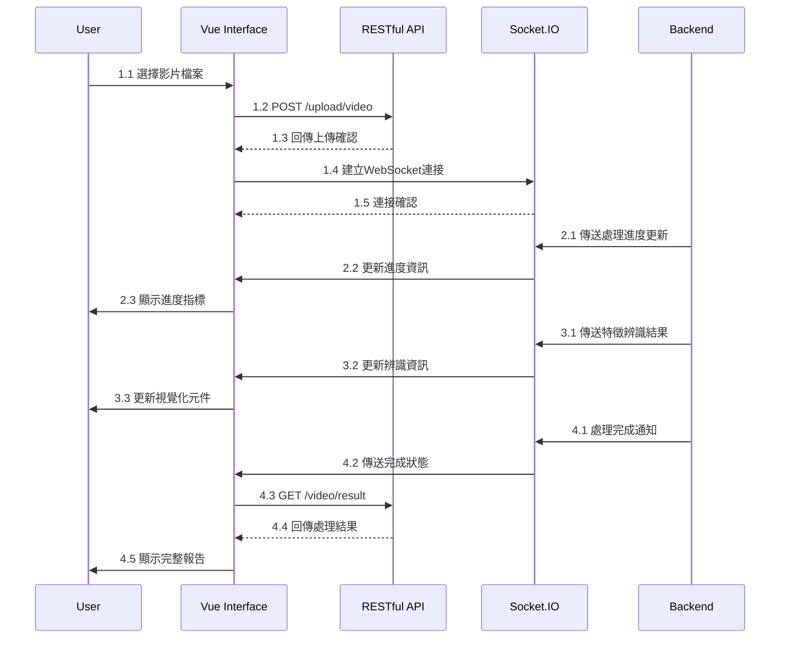

# Pairon_frontend

本專案為個人碩論[整合深度學習與多重特徵提取之人物辨識及全身追蹤系統](https://nfuedu-my.sharepoint.com/:b:/g/personal/11161115_nfu_edu_tw/EYsucjSdPC5EilwhdXpUICMBe2WGj3V94p1UbM2N3-0HIg?e=vmi2eI)的前端實作部分，需要配合[後端](https://github.com/FelixChen1224/Pairon)運行。

## 專案流程

## 專案畫面

